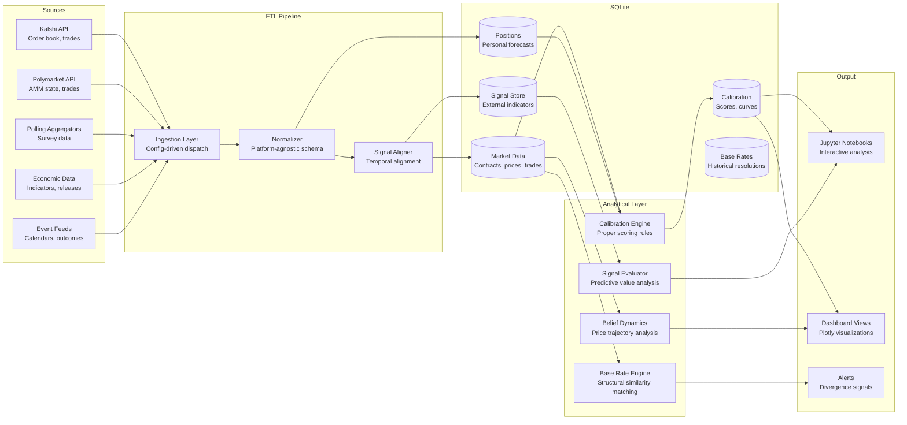
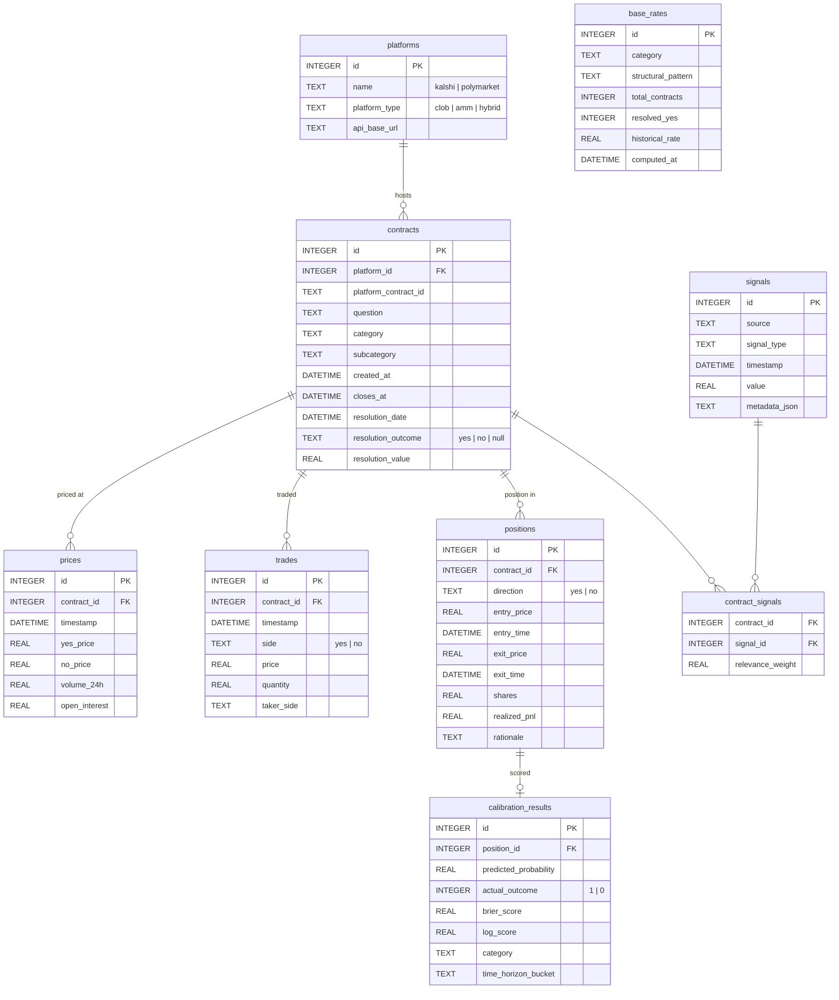

# Prediction Market Analytics — Architecture

A Python/SQLite system that consolidates prediction market data from multiple platforms into a unified analytical environment. Built for systematic forecasting research across Kalshi, Polymarket, and external signal sources.

## Problem

Prediction markets aggregate crowd beliefs into prices, but evaluating whether a price is well-calibrated requires more than the price itself. You need:

- Historical resolution patterns for structurally similar contracts
- External signals (polls, economic indicators, expert forecasts) that bear on the same underlying question
- Personal calibration data — where have your probability estimates been systematically too high or too low?
- Market microstructure data — how did this price arrive at $0.65? Was it a steady convergence or a sudden correction?

The existing workflow involves manual cross-referencing: check the Kalshi order book, open a polling aggregator in another tab, search for the last time a similar contract resolved, and try to hold it all in working memory while making a decision. This is precisely the kind of multi-source reasoning that breaks down under cognitive load — and cognitive load is the enemy of calibration.

Three problems to address:

1. **Signal fragmentation.** Relevant evidence is scattered across platforms, data providers, and personal records. Synthesizing it requires context-switching that is lossy and attention-depleting.
2. **Calibration opacity.** Without systematic tracking, you cannot distinguish skill from luck, or identify the domains and conditions where your forecasting is systematically biased.
3. **Temporal misalignment.** Market prices update continuously, but external signals arrive on different schedules (polls weekly, economic data monthly, events irregularly). Bringing these into temporal alignment requires infrastructure, not manual effort.

## Architecture Overview



## Data Model

The schema uses a **normalized market-centric design**: contracts are the central entity, with prices, trades, positions, signals, and calibration results linked through foreign keys.



**Why this shape?** Prediction markets have a natural entity hierarchy: platforms host contracts, contracts have prices over time, positions express beliefs about contracts, and calibration scores measure those beliefs against reality. Signals live in their own table because the same signal (e.g., an unemployment report) may be relevant to multiple contracts. The `contract_signals` junction table with a `relevance_weight` column allows the same signal to matter differently for different contracts.

### Derived Analytical Views

On top of the normalized tables, SQL views provide the analytical interface:

- **`view_contract_summary`** — Current price, volume, time to resolution, platform, category. The default "what's active" view.
- **`view_position_performance`** — Entry price, current price, unrealized P&L, resolution outcome if resolved, Brier score. The "how am I doing" view.
- **`view_calibration_curve`** — Predicted probabilities binned into deciles, compared against actual resolution rates. The "am I calibrated" view.
- **`view_signal_correlation`** — Signal values temporally aligned with subsequent price movements. The "what actually predicts" view.
- **`view_market_efficiency`** — Price at various time horizons before resolution, compared against final outcome. The "how fast do markets learn" view.

## ETL Pipeline

The pipeline is config-driven. Adding a new data source requires only configuration rows — no Python changes.

**Three modules, clean separation:**

| Module | Responsibility | Key Pattern |
|--------|---------------|-------------|
| `Ingestion` | Route key → API call via config table | Config-driven dispatch with platform-specific auth |
| `Normalizer` | Platform-specific JSON → common schema | Field mapping tables translate platform vocabularies |
| `SignalAligner` | Temporal alignment of market and signal data | Bucketed joins on time windows, forward-fill for sparse signals |

### Ingestion

Each platform API returns data in its own format. Kalshi provides CLOB data (order book depth, individual trades, tick-level prices). Polymarket provides AMM data (pool sizes, implied prices, liquidity depth). The ingestion layer handles authentication, pagination, and rate limiting per platform, producing raw JSON snapshots stored in a staging table.

```python
# Config-driven: platform_id → module + function + auth
ref_platform_config = {
    "kalshi": {"module": "sources.kalshi", "function": "fetch_markets", "auth": "api_key"},
    "polymarket": {"module": "sources.polymarket", "function": "fetch_markets", "auth": "none"},
}
```

### Normalization

The normalizer translates platform-specific field names and value representations into the common schema. A Kalshi contract has `yes_price` directly; a Polymarket contract has AMM pool sizes from which `yes_price` must be computed. The normalizer handles these transformations via field routing tables:

```sql
-- ref_field_routing: how to extract a common field from a platform-specific JSON
-- platform: kalshi,    app_field: yes_price,    source_path: $.yes_price
-- platform: polymarket, app_field: yes_price,   source_path: $.computed_price
-- platform: polymarket, app_field: liquidity,   source_path: $.pool_size
```

### Signal Alignment

External signals arrive on different timescales. Polling data might update weekly, economic indicators monthly, and event outcomes irregularly. The signal aligner uses bucketed temporal joins to bring signals into alignment with market prices:

```sql
-- Align signals with market prices using temporal windows
-- For each price observation, find the most recent signal value
SELECT
    p.contract_id,
    p.timestamp AS price_time,
    p.yes_price,
    s.value AS signal_value,
    s.timestamp AS signal_time
FROM prices p
LEFT JOIN LATERAL (
    SELECT value, timestamp
    FROM signals s
    JOIN contract_signals cs ON cs.signal_id = s.id
    WHERE cs.contract_id = p.contract_id
      AND s.timestamp <= p.timestamp
    ORDER BY s.timestamp DESC
    LIMIT 1
) s ON TRUE
```

In practice, the alignment uses SQLite-compatible correlated subqueries with time-window bucketing, since SQLite lacks `LATERAL` joins.

## Calibration Engine

The calibration engine computes proper scoring rules against resolved outcomes, providing the primary feedback mechanism for forecasting improvement.

### Proper Scoring Rules

- **Brier score** — `(predicted_probability - actual_outcome)²`. Range 0–1, lower is better. Decomposable into reliability (calibration) and resolution (discrimination) components.
- **Logarithmic score** — `-log(predicted_probability)` if the event occurred, `-log(1 - predicted_probability)` if not. More severely penalizes confident wrong predictions.

### Calibration Curves

Predicted probabilities are binned into deciles (0.0–0.1, 0.1–0.2, ..., 0.9–1.0). Within each bin, the actual resolution rate is computed. Perfect calibration means the 70% bin resolves "yes" 70% of the time. Systematic deviations reveal directional biases:

- **Overconfidence** — high-probability predictions resolve less often than predicted (the 90% bin resolves at 75%)
- **Underconfidence** — low-probability predictions resolve more often than predicted (the 20% bin resolves at 35%)
- **Domain-specific bias** — calibration curves differ by category (well-calibrated on economics, overconfident on politics)

### Segmentation

Calibration is computed along multiple dimensions:
- **Category** — politics, economics, weather, sports, culture
- **Time horizon** — contracts resolving in <1 week, 1–4 weeks, 1–3 months, 3+ months
- **Confidence level** — positions taken at extreme prices (<0.15 or >0.85) vs. uncertain prices (0.35–0.65)
- **Platform** — performance differences between Kalshi and Polymarket markets

## Belief Dynamics Analysis

Markets process information at different speeds and with different efficiency. The belief dynamics module traces how contract prices evolve in response to information events.

**Key metrics:**
- **Incorporation speed** — How quickly does a price move from pre-event levels to post-event equilibrium?
- **Overreaction index** — Does the initial price movement overshoot the final equilibrium? By how much?
- **Mean reversion timescale** — After an overreaction, how long until the price stabilizes?
- **Volume signature** — Does informed trading produce a distinctive volume pattern before/after information events?

## Key Design Decisions

### Source-agnostic schema over platform-specific tables

Different platforms use fundamentally different market mechanisms (CLOB vs. AMM), but the analytical questions are the same: what's the implied probability, how is it moving, and is it calibrated? A unified schema with platform-specific normalization at ingestion time means all downstream analytics work identically regardless of source.

### Proper scoring rules over P&L as the primary metric

Profit and loss depends on position sizing, timing, and market liquidity — factors that obscure forecasting skill. Brier scores and calibration curves measure the thing that actually matters: was the probability estimate accurate? P&L is tracked for practical purposes, but the analytical system treats calibration as the primary signal.

### SQL views as analytical contracts

All multi-table reads go through SQL views. The views define the analytical interface; Python code trusts the view columns. This means adding a new analytical dimension (e.g., a new segmentation for calibration curves) is a view change, not a code change.

### Config-driven ETL over hardcoded platform handlers

The same rationale as any config-driven pipeline: adding Metaculus or PredictIt as a new source should require configuration rows (field mappings, auth method, API base URL), not new Python modules for each platform's idiosyncrasies.

## Technical Stack

- **Runtime:** Python 3.12, SQLite (WAL mode)
- **Data processing:** Pandas, NumPy, SciPy
- **Visualization:** Plotly (interactive), matplotlib/seaborn (static), Jupyter
- **APIs:** Kalshi REST API, Polymarket Gamma API
- **Scoring:** Custom implementation of Brier, logarithmic, and CRPS scoring rules
- **Testing:** pytest, synthetic market data generators for backtesting
